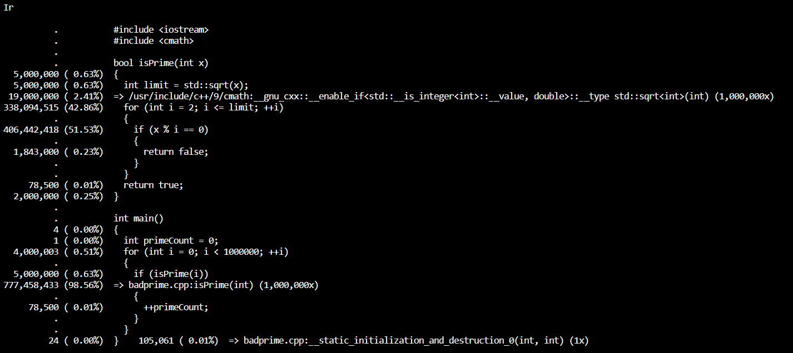

## Prova Intermediária

Aluno: Carlos Dip

_____

### Questão 1

Resolvida no diretório 'questao 01'

### Questão 2

Q: Com relação ao problema anterior, a estratégia gulosa nos garante uma solução ótima? Justifique.

R: Não, o algoritmo da heurística gulosa não garante uma solução ótima global. Em alguns casos é possível que ele atinja tal solução, porém ele é muito dependente da entrada. Entradas onde existe muita heterogeneidade seriam mais problemáticas, como por exemplo uma entrada onde existem jobs muito grandes e jobs muito pequenos, é possível que o tempo fique mal distribuído por conta dos jobs grandes ocupando muito espaço. Ainda assim, parece que nesse caso tem um raio de aproximação muito bom.

### Questão 3

Q: Proponha uma estratégia de busca exaustiva para resolução da questão do item 1. Apresente pseudo-código.

R: É possível usar análise combinatória para resolver o problema de forma exaustiva

Dados J jobs para N máquinas:

Determine todas as permutações de J na forma binária:

e.g. 3 jobs = 000, 001, 010, 011, 100, 101, 110, 111

Determine todas as combinações dessas permutações onde os jobs aparecem exatamente uma vez:

e.g. 3 jobs 2 máquinas = (000,111),(001,110),(010,101),(011,100)  

Calcule a soma do tempo dos jobs para todas as máquinas, e determine o maior (tempo de gargalo da solução). Em seguida determine o menor tempo de gargalo entre todas as soluções geradas.

Uma solução semelhante foi implementada com bitset para o problema da mochila no curso (main_bitset.cpp).

### Questão 4

Q: Em sala de aula, nós implementamos diversas estratégias para a mochila
binária. Explique a importância de buscar um balanço entre exploration e exploitation. Dê um exemplo de
como buscamos atingir exploration e outro de como buscamos atingir exploitation no problema da mochila
binária.

R: Dentro do espaço de soluções possíveis (seja ele discreto ou contínuo) existem soluções que fazem uso somente de exploitation, que buscam, a partir de uma possível solução, melhorá-la ao máximo fazendo uso de conhecimentos prévios sobre a estrutura do problema, como é o caso da heurística gulosa. Existem também soluções que visam apenas a exploration como buscas aleatórias, onde são geradas grandes quantidade de soluções completamente aleatórias. A importância vem do seguinte problema: Apenas exploitation, facilmente prende-se a máximos locais, nunca atingindo a verdadeira solução ótima, porém puro exploration desperdiça muito tempo olhando soluções inválidas, sem nenhuma estratégia lógica. A vantagem de buscar o equilíbrio entre os dois conceitos vem de usar o conhecimento do problema para melhorar soluções, porém usar também da aleatoriedade para desprender tentativas de ótimos locais. Um algoritmo implementado que tenta atingir melhor esse equilíbrio é o de busca local, onde são geradas muitas tentativas aleatórias (exploration) e então elas tentam ser melhoradas quando possível (exploitation). Outro exemplo que não foi feito em aula, mas que eu fiz, é o algoritmo genético, que funciona em ambas as frentes por muitos motivos.

### Questão 5

Q: Analisar badprime.cpp

R: Como pode ser analisado na saída do valgrind, 99% das instruções são realizadas na função is_prime. Nela, temos 2 grandes problemas, que na verdade são condesados em 1. O 'for i in range sqrt(x)' é executado muitas vezes, porém isso é consequência de outra coisa, da comparação logo em seguida. Essa comparação é executada muitas vezes, quando não precisa ser. Muitas das comparações sendo feitas, já foram feitas em outros ciclos, quando analisando primos. A ideia atual do algoritmo é simples, para todo número que queremos descobrir se é primo, teste o resto da divisão para todo inteiro menor que sua raiz quadrada. Isso é válido, e funciona, mas na realidade, basta testar a divisibilidade por todos os primos anteriores. A desvantagem seria armazenar todos os primos na memória, porém não são tantos, e pode-se argumentar que é um gasto válido de memória por conta do ganho de performance.

### Questão 6

Q: Analise sua implementação de SmithWaterman e discorra sobre como melhorá-la para entradas maiores.

R: Existem alguns problemas na implementação de Smith Waterman construída. Entre esses, é que uma matriz de structs (com 3 ints cada) de dimensões 3000x3000 já ocupa 2.7MB de memória aproximadamente (que para uma matriz tradicional precisam ser consecutivos), o que podeira ser reduzido usando estruturas de dados menos estritas, como uma matriz esparsa, ou uma lista de ponteiros. Outra coisa a melhorar é a ordem em que calculamos os dados. Na forma atual, é calculada uma linha, e depois a próxima, porém com alguns cuidados, é possível que os cálculos se propaguem para baixo também, de maneira paralela. Assim que uma célula é calculada, a célula a sua esquerda e abaixo de si podem ser calculados também. Isso ajudaria na velocidade, paralelizando um pouco o procedimento. Ou, caso possível usar memória adicional, seria possível calcular não 1 matriz, mas 3, uma para cada tipo de alteração (inserção, deleção, diagonal) em paralelo, e então usar as três para remontar a matriz final seria possível de maneira simultânea (não tenho tanta certeza sobre quão eficaz seria fazer algo desse tipo, mas parece válido). Mais especificamente na minha implementação, no 'for' das linhas 59-89, existem algumas comparações que poderiam ser simplificadas também, já que esse loop é onde o código gasta a maioria do processamento, isso poderia ajudar.

